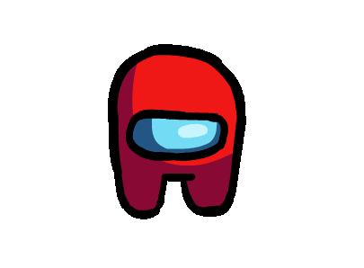

<h1 align="center">Hi 👋! My name is Sergio Castrillón and I'm from Colombia</h1>

</img>
###

# 🛠  Tech Stack:

  
  
  
  
  
  
  
  
  
  
  
  
  

###

# 🤝🏻  Connect with Me 

  
  
  
  
  

###

# 📊 GitHub Stats:
 
 

---

<!-- Proudly created with GPRM ( https://gprm.itsvg.in ) -->
